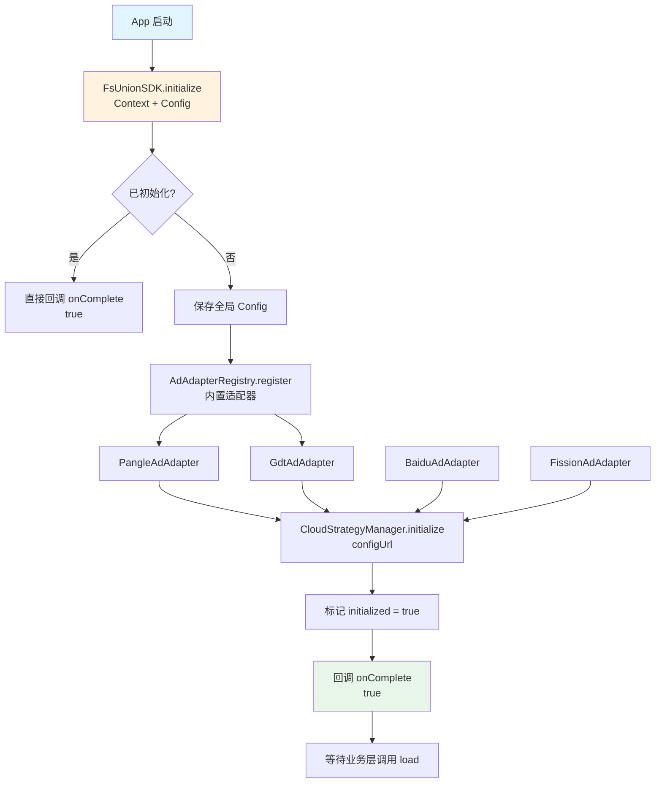
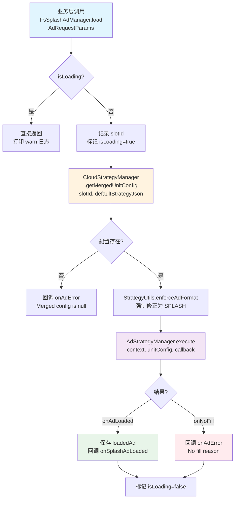
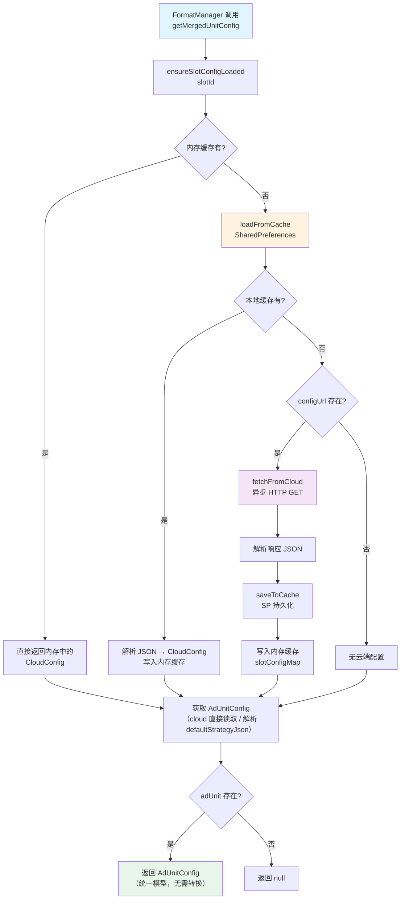
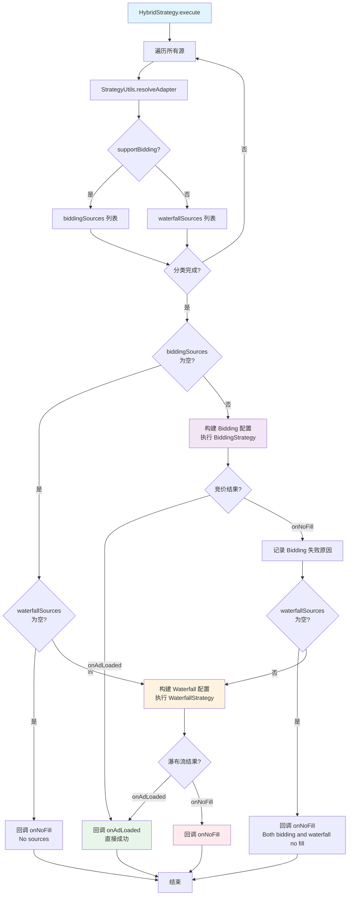
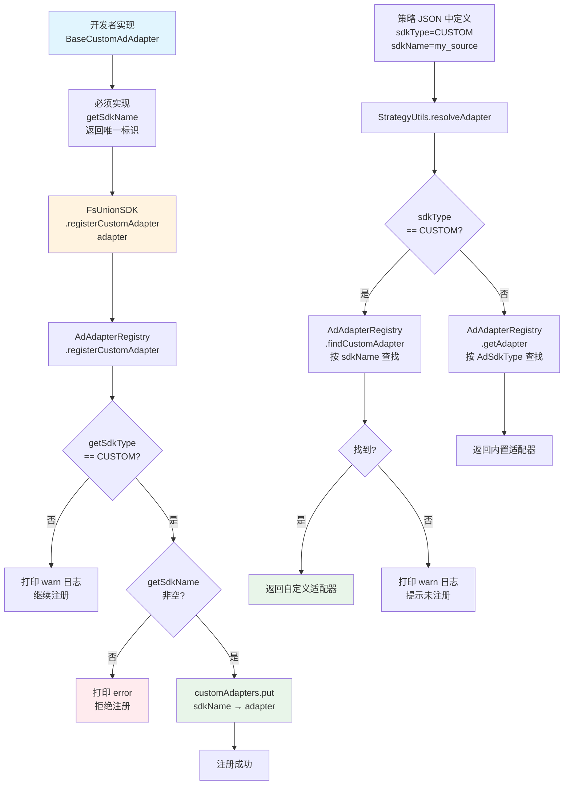
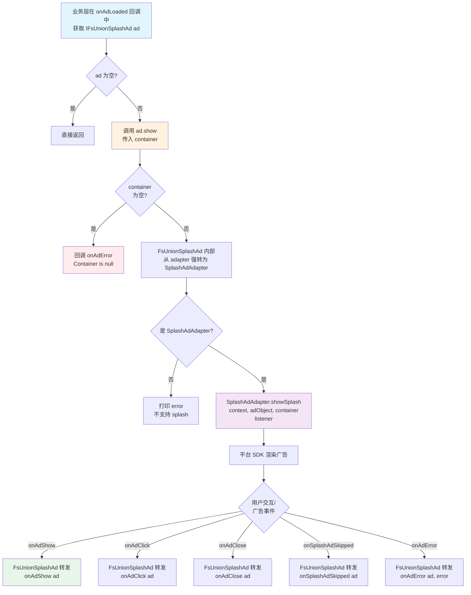

# 聚合 SDK 各模块逻辑流程图

> 本文档用 **Mermaid 流程图** 描述聚合 SDK 核心模块的运行时逻辑。建议在支持 Mermaid 的 Markdown 编辑器（如 Typora、VSCode、GitHub）中查看图形渲染效果。

---

## 目录

1. [SDK 初始化流程](#1-sdk-初始化流程)
2. [广告加载主流程](#2-广告加载主流程)
3. [配置管理流程](#3-配置管理流程)
4. [策略分发与执行流程](#4-策略分发与执行流程)
5. [竞价策略流程（Bidding）](#5-竞价策略流程bidding)
6. [瀑布流策略流程（Waterfall）](#6-瀑布流策略流程waterfall)
7. [混合策略流程（Hybrid）](#7-混合策略流程hybrid)
8. [自定义适配器注册与匹配流程](#8-自定义适配器注册与匹配流程)
9. [广告展示流程](#9-广告展示流程)

---

## 1. SDK 初始化流程



**关键说明：**
- 初始化时**只注册适配器实例**，不会立即初始化各平台 SDK（各平台 appId 不同，由策略引擎在广告请求前按需触发）
- 注册前先经 `isSdkAvailable()` 反射探测对应三方 SDK 是否已集成（关键类是否在 classpath），**未集成的平台自动跳过注册**，策略层解析到该广告源时得到 null 快速跳过，避免 `NoClassDefFoundError` 崩溃
- `cloudConfigUrl` 为空时，不触发云端拉取，完全依赖 `defaultStrategyJson`
- 自定义适配器通过 `registerCustomAdapter()` 在初始化后单独注册（同样经 `isSdkAvailable()` 校验，未集成则 warn 跳过）

---

## 2. 广告加载主流程

以 `FsSplashAdManager.load()` 为例，所有 FormatManager（Interstitial / Rewarded / FeedTemplate / FeedRender）流程一致。



**关键说明：**
- `AdRequestParams` 必填字段只有 `slotId`，`defaultStrategyJson` 为可选兜底配置
- `enforceAdFormat()` 确保配置中的 `adFormat` 与当前 Manager 类型一致，防止外部 JSON 配置错误
- `AdStrategyManager` 按 `slotId` 管理策略执行，重复加载同一 slotId 会自动取消上一次请求

---

## 3. 配置管理流程



**关键说明：**
- **选择优先级**：本地缓存/云端 > `defaultStrategyJson`，不存在 "merge 合并" 逻辑
- 缓存按 `slotId` 隔离，每个广告位独立缓存版本号和配置内容
- 云端拉取是**异步**的，首次 load 时可能还未拉取完成，此时使用 defaultStrategyJson 兜底；后续 load 时云端配置已缓存，自动生效

---

## 4. 策略分发与执行流程

```mermaid
flowchart TD
    A[AdStrategyManager.execute\nparams, unitConfig, callback] --> A1{params.slotId ==\nunitConfig.slotId?}
    A1 -->|否| A2[log 错误 + onNoFill\nslotId mismatch]
    A1 -->|是| B{strategies.size() >= 2\n即多阶段 priority chain?}
    B -->|是| E[创建 HybridStrategy]
    B -->|否| C{strategies[0].\ntype?}
    C -->|BIDDING| C1[创建 BiddingStrategy]
    C -->|WATERFALL| D[创建 WaterfallStrategy]
    C1 & D & E --> F[strategy.execute\ncontext, params, unitConfig, callback]
    F --> G[异步执行广告请求...\n新旧请求完全独立、互不影响]

    style A fill:#e1f5fe
    style A1 fill:#ffebee
    style B fill:#fff3e0
    style C fill:#fff3e0
    style F fill:#f3e5f5
```

**关键说明：**
- `AdStrategyManager.execute()` 是策略执行的工厂入口，入口处强制做 `params.slotId == unitConfig.slotId` 严格匹配校验，不一致时直接 `onNoFill("slotId mismatch")` 拒绝执行
- 路由方式：`strategies.size() >= 2` 走 `HybridStrategy`（priority chain）；单阶段按 `strategies[0].type` 路由到 `BiddingStrategy` 或 `WaterfallStrategy`
- `HybridStrategy.getStrategyType()` 仍返回 `StrategyType.HYBRID`，仅供业务方打点/日志区分用
- 每次 `execute` 都会创建全新的策略实例并启动一次独立任务
- 同一 `slotId` 重复加载时不会拦截，新旧请求并发跑、各自拿结果，业务方各自处理 callback

---

## 5. 竞价策略流程（Bidding）

```mermaid
flowchart TD
    A[BiddingStrategy.execute] --> B[过滤 enabled=true 的源]
    B --> C{有竞价源?}
    C -->|否| D[回调 onNoFill\nNo bidding sources]
    C -->|是| E[并行遍历所有源]

    E --> F[StrategyUtils.resolveAdapter\n获取适配器]
    F --> G{适配器存在\n且 supportBidding?}
    G -->|否| H[跳过该源]
    G -->|是| I1[AdAdapterRegistry\n.ensureInitializedAsync\n注册 AdInitListener]
    I1 --> I2[独立 init 线程\nadapter.initialize]
    I2 --> I3{回调?}
    I3 -->|onInitSuccess| J[adapter.request\n发送竞价请求]
    I3 -->|onInitFailure| H
    I3 -->|超时\n(watcher 兜底)| I4[视为 init 失败] --> H
    J --> K[等待竞价超时\ntimeoutMs（全局，包含 SDK 初始化 + 请求召回）]
    K --> L{竞价结果?}
    L -->|onBidSuccess\nprice >= bidFloor| M[收集 UnionAdResponse]
    L -->|onBidSuccess\nprice < bidFloor| N[过滤掉\n低于底价]
    L -->|onBidFailure| O[记录失败日志]
    L -->|超时| P[记录超时日志]
    H & M & N & O & P --> Q{所有源\n处理完成?}
    Q -->|否| E
    Q -->|是| R{有有效竞价?}
    R -->|否| S[回调 onNoFill\nNo valid bids]
    R -->|是| T[按 price 降序排序]
    T --> U[遍历排序后的竞价\n用 adUnitId 唯一定位 AdSourceConfig]
    U --> V{UnionAdResponse\n已包含 nativeAd?}
    V -->|是| W[直接回调 onAdLoaded]
    V -->|否| X[StrategyUtils.requestWithTimeout\n异步加载广告\n(回调驱动)]
    X --> Y{加载成功?}
    Y -->|是| W
    Y -->|否| Z[尝试下一个竞价方]
    Z --> U
    Z -->|全部失败| AA[回调 onNoFill\nAll bidders failed]

    W & S & AA --> AB[结束]

    style A fill:#e1f5fe
    style E fill:#fff3e0
    style J fill:#f3e5f5
    style W fill:#e8f5e9
    style S fill:#ffebee
    style AA fill:#ffebee
```

**关键说明：**
- 所有竞价请求**并行**发送，使用 `CountDownLatch` 等待全局超时
- 单个竞价也有独立的 `CountDownLatch` 控制，防止某个平台阻塞整体流程
- 低于 `bidFloor`（底价）的竞价会被过滤，不参与最终排序
- 排序后按价格从高到低依次尝试加载，若 `UnionAdResponse` 已包含 `nativeAd` 则直接使用，无需再次 request
- **adUnitId 是竞价链路的唯一确定性标识**：`UnionAdResponse` 携带 adUnitId，`BiddingStrategy.findSourceConfig` 通过 adUnitId 唯一定位 `AdSourceConfig`（一家 SDK 配置多个 adUnitId 参与竞价时不会撞车）

---

## 6. 瀑布流策略流程（Waterfall）

```mermaid
flowchart TD
    A[WaterfallStrategy.execute] --> B[过滤 enabled=true 的源]
    B --> C[按 priority 升序排序]
    C --> D{有可用源?}
    D -->|否| E[回调 onNoFill\nNo sources available]
    D -->|是| F[按顺序遍历排序后的源]
    F --> G{已取消?\n或已加载?}
    G -->|是| H[跳出循环]
    G -->|否| I[StrategyUtils.resolveAdapter]
    I --> J{适配器存在?}
    J -->|否| K[跳过，尝试下一个]
    J -->|是| L1[AdAdapterRegistry\n.ensureInitializedAsync\n注册 AdInitListener]
    L1 --> L2[独立 init 线程\nadapter.initialize]
    L2 --> L3{回调?}
    L3 -->|onInitSuccess| M[StrategyUtils.requestWithTimeout\n异步加载广告\n(回调驱动)]
    L3 -->|onInitFailure\n或超时| L4[记录失败\n跳过当前源] --> K
    M --> N{加载结果?}
    N -->|Success| O[标记 adLoaded=true\n回调 onAdLoaded]
    N -->|Failure| P[记录失败，尝试下一个]
    N -->|Timeout| Q[记录超时，尝试下一个]
    K & P & Q --> F
    H & O --> R{adLoaded?}
    R -->|否| S[回调 onNoFill\nAll sources failed]
    O --> T[结束]
    S --> T
    E --> T

    style A fill:#e1f5fe
    style C fill:#fff3e0
    style M fill:#f3e5f5
    style O fill:#e8f5e9
    style S fill:#ffebee
```

**关键说明：**
- 瀑布流是**串行**执行，按 `priority` 从小到大依次尝试（priority 数值越小优先级越高）
- 每个源使用 `StrategyUtils.requestWithTimeout()` 异步加载（`StrategyUtils` 内部不再做超时调度，只转发 Adapter 回调；微观超时由各 Adapter 内部 `AdLoadTimeout` 兜底，宏观超时由 WaterfallStrategy 自己的 `scheduledExecutor` 控制）
- 一旦某个源加载成功，立即停止后续尝试；若全部失败，回调 `onNoFill`

---

## 7. 混合策略流程（Hybrid）



**关键说明：**
- Hybrid 是 Bidding + Waterfall 的组合策略
- 先按 `supportBidding()` 将源分为两组：支持竞价的走 Bidding，不支持的走 Waterfall
- 如果完全没有竞价源，直接走 Waterfall（退化为纯瀑布流）
- 竞价失败后会自动 fallback 到 Waterfall，最大化填充率

---

## 8. 自定义适配器注册与匹配流程



**关键说明：**
- 自定义适配器的 `getSdkName()` 返回值必须与策略 JSON 中的 `sdkName` 字段**完全一致**（区分大小写）
- 多个自定义适配器独立注册，通过不同 `sdkName` 区分，互不干扰
- 内置适配器通过 `AdSdkType` 枚举查找，自定义适配器通过 `sdkName` 字符串查找

---

## 9. 广告展示流程

以 `IFsUnionSplashAd.show()` 为例（业务方只面向接口编程），其他格式（Interstitial / Rewarded / NativeExpress / Native）展示流程类似。



**关键说明：**
- `load()` 成功后通过 `onAdLoaded(IFsUnionSplashAd ad)` 回调将广告对象接口传给业务层，业务层通过 `ad.show(container)` 触发展示
- 展示能力封装在广告对象内部（实现类为 `FsUnionSplashAd`）：广告对象持有 `UnionAdResponse` + `AdAdapter`，`show()` 时自动从 adapter 强转为格式适配器并调用展示接口
- 展示完成后（finish / skip / close）会自动清空 `loadedAd`，防止重复展示
- 各格式展示接口不同：`IFsUnionSplashAd.show(container)`、`IFsUnionInterstitialAd.show()`、`IFsUnionRewardedVideoAd.show()`、`IFsUnionNativeExpressAd.getExpressView()`、`IFsUnionNativeAd` 提供素材方法和 `reportShow()` / `reportClick()` 上报接口
- 业务层可通过广告对象直接获取广告信息：`ad.getEcpm()`、`ad.getSdkType()`、`ad.getSdkName()`、`ad.getSlotId()`

---

## 附录：核心类职责速查

| 类名 | 职责 |
|---|---|
| `FsUnionSDK` | SDK 入口，初始化、注册适配器、创建 FormatManager |
| `AdAdapterRegistry` | 适配器注册中心（内置 + 自定义），按需初始化平台 SDK |
| `CloudStrategyManager` | 云端配置拉取、本地缓存、配置选择（云端 > 默认） |
| `AdStrategyManager` | 策略执行总控，按 `slotId` 管理策略生命周期 |
| `BiddingStrategy` | 实时竞价：并行 bid → 过滤底价 → 排序 → 依次加载 |
| `WaterfallStrategy` | 瀑布流：按 priority 排序 → 串行加载 → 成功即停 |
| `HybridStrategy` | 混合策略：竞价 + 瀑布流，竞价失败 fallback 到瀑布流 |
| `StrategyUtils` | 工具类：解析适配器、带超时加载、强制修正 adFormat |
| `FsSplashAdManager` | 开屏广告 Manager（其他 FormatManager 结构类似） |
